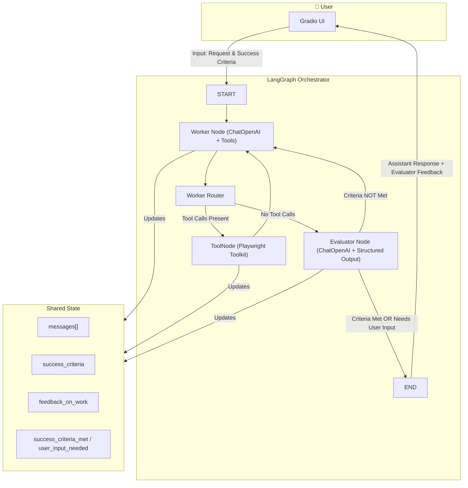
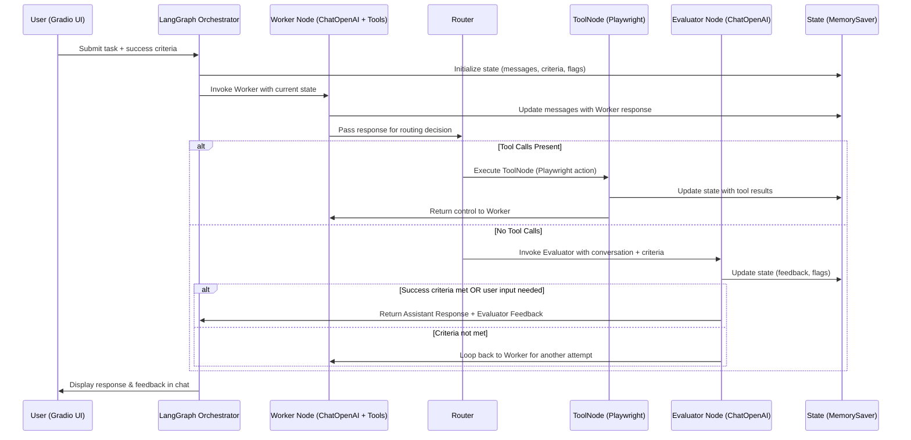

# **LangGraph Sidekick**
> **LangGraph Sidekick** is a multi-agent AI assistant built with **LangGraph**, **LangChain**, **Playwright**, and **Gradio**.  
> It collaborates with users to complete tasks, evaluates responses against success criteria, and provides structured feedback in a continuous loop until the criteria are met or user clarification is required.

---

## **Features**
- **Multi-Agent Orchestration**  
  - **Worker Agent**: Executes tasks using ChatGPT and browser automation tools.  
  - **Evaluator Agent**: Validates results against user-defined success criteria with structured feedback.  
- **Tool Integration**  
  - Equipped with **Playwright** for web browsing and automated actions.  
- **Structured Outputs**  
  - Evaluator produces consistent, machine-readable feedback using **Pydantic models**.  
- **Stateful Execution**  
  - **LangGraph** maintains state (messages, feedback, criteria) across iterative steps.  
- **Interactive Chat Interface**  
  - Powered by **Gradio**, enabling an easy-to-use, real-time conversational interface.

---

## **Architecture**
### **Flow Diagram**

### **Sequence Diagram


### Project Structure
```
langgraph-sidekick/
│
├── app/
│   ├── __init__.py
│   ├── state.py             # State & Pydantic models
│   ├── worker.py            # Worker node (task execution)
│   ├── evaluator.py         # Evaluator node (feedback & validation)
│   ├── router.py            # Routing logic
│   ├── tools.py             # Playwright browser toolkit setup
│   ├── graph_builder.py     # LangGraph orchestration setup
│
├── ui/
│   ├── __init__.py
│   ├── gradio_app.py        # Gradio chat interface
│
├── main.py                  # Entry point to launch the app
├── .env                     # Environment variables (e.g., OpenAI key)
├── requirements.txt         # Project dependencies
└── README.md                # Project overview & documentation
```


